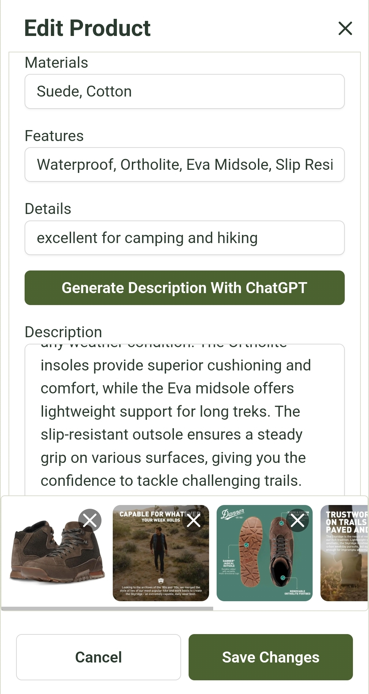

# AI-Powered E-Commerce Platform with Admin Dashboard (MVP)

A modern, full-stack e-commerce web application featuring a dynamic storefront, a comprehensive admin dashboard, and **cutting-edge AI-powered tools** for product management and customer engagement. Built as a fully functional MVP to showcase scalable, maintainable full-stack development with AI integration.

### 🌐 [_Live Demo - Click Here_](https://main.d22nzzi4zwdyek.amplifyapp.com/demo-mode)

---

## 🖼️ Preview Images

### 💻 Desktop

	
	

	
	

### 📱 Mobile

	
    
    
    

---

## 🚀 Project Overview

This project is a **fully functional AI-powered e-commerce MVP** with a **dynamic storefront** and a **comprehensive admin dashboard**. It features **AI enhancements** that highlight modern full-stack and AI integration skills:

### Key Features

- Add, manage, and organize **products, categories, and collections**
- Support **product variants** (size, color, etc.)
- **Automatic stock updates** when orders are placed
- Manage **orders**, generate **shipping labels**, and verify addresses
- Fully **customizable site settings**: banners, icons, site name, theme colors, tax rules, shipping limits
- **Basic user accounts**: sign up, log in, and authentication
- Responsive design for **desktop and mobile devices**
- Smooth UI interactions and animations with **Framer Motion**

### 🤖 AI-Powered Features

- **Product Chat Assistant:** On each product page, a ChatGPT-powered chat bubble can answer customer questions and provide detailed information about the product.
- **AI-Generated Product Descriptions:** Admins can automatically generate professional product descriptions based on product features, materials, and specifications.
- Demonstrates the ability to **integrate AI tools directly into a full-stack web application**.

---

## 🏗️ Tech Stack

**Frontend:**

- TypeScript, React, Vite
- React Router for SPA navigation
- Tailwind CSS + Shadcn UI for custom components
- Framer Motion for animations
- React Hook Form + Zod for form validation
- Redux for global state
- TanStack Query for caching and optimized data fetching

**Backend:**

- Express.js with CORS and cookie-parser
- Axios for API communication
- JWT + Argon2 for authentication
- Prisma ORM with PostgreSQL (via Supabase)
- Stripe for payments
- EasyPost for shipping and address verification
- OpenAI API for AI chat assistant and product description generation

**Infrastructure & Deployment:**

- Frontend deployed on **Vercel**
- Backend deployed on **Render**
- Image storage using **ImgBB** and **Supabase**
- Environment variables managed via `.env`

**Code Quality:**

- ESLint for static analysis
- Prettier for consistent formatting

---

## 🔥 Key Highlights

- **Full-stack functionality:** Frontend and backend fully integrated with persistent data
- **E-commerce logic:** Product variants, stock updates upon order placement, dynamic site settings, shipping, and payment integration
- **AI Integration:** ChatGPT-powered assistant and automated product description generation
- **Performance optimizations:** Efficient caching, lazy loading, and optimized React rendering
- **Scalable architecture:** Clear separation of `frontend`, `backend`, and `shared` types/utilities
- **Professional UI/UX:** Fully responsive, interactive dashboards
- **Secure authentication:** Basic user accounts with JWT authentication and Argon2 password hashing

---

## 🗂️ Project Structure

This is a **monorepo** with three main folders:

- **`/backend`** - Express.js API server handling database operations, authentication, payments, shipping, and AI requests
- **`/frontend`** - React storefront and admin dashboard where users shop, admins manage everything, and AI features live
- **`/shared`** - TypeScript types and utilities used by both frontend and backend

### How It Works

**For Customers:**

- Browse products on the storefront (`/frontend/src/pages/HomePage.tsx`)
- Chat with the AI assistant to learn more about each product
- Add items to cart, checkout with Stripe payments
- Create accounts and view order history

**For Admins:**

- Access admin dashboard at `/admin` route
- Manage products, orders, users, and site settings
- Generate AI-powered product descriptions automatically
- All admin functionality is in `/frontend/src/features/admin-dash/`

**For Developers:**

- Backend API routes are in `/backend/src/routes/`
- Frontend components are organized by feature in `/frontend/src/features/`
- Database schema is in `/backend/prisma/schema.prisma`
- Shared types ensure frontend and backend stay in sync
